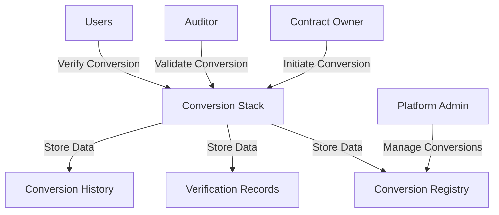

# BulletProof Convert Stack

A sophisticated smart contract conversion and verification framework for secure blockchain interactions on the Stacks blockchain.

## Overview

BulletProof Convert Stack provides a comprehensive solution for:
- Secure smart contract conversion
- Verification of contract integrity
- Transparent audit and trust mechanisms
- Robust conversion tracking and validation

The platform ensures high-quality contract migrations and transformations with built-in security checks and comprehensive tracking.

## Architecture



### Core Components
- **Conversion Registry**: Manages contract conversion requests
- **Verification System**: Handles integrity checks and validation
- **Audit Trail**: Maintains comprehensive conversion records
- **Trust Mechanism**: Provides transparent conversion tracking

## Contract Documentation

### convert-stack.clar

The main contract managing smart contract conversions and verifications.

#### Key Features
- Conversion request management
- Contract integrity verification
- Conversion history tracking
- Security audit mechanisms

#### Access Control
- Contract Owner: Platform administration
- Auditors: Conversion validation
- Public: Conversion verification
- Contract Owners: Conversion requests

## Getting Started

### Prerequisites
- Clarinet
- Stacks wallet
- Blockchain development experience

### Basic Usage

1. **Request Conversion**
```clarity
(contract-call? 
  .convert-stack 
  request-conversion 
  contract-principal 
  "1.0.0" 
  "Contract description" 
  "https://github.com/repo")
```

2. **Verify Conversion**
```clarity
(contract-call? 
  .convert-stack 
  verify-conversion 
  contract-principal 
  "1.0.0")
```

## Development

### Testing
1. Set up local Clarinet environment
```bash
clarinet new
```

2. Deploy contracts
```bash
clarinet console
```

### Security Considerations
- Comprehensive conversion validation
- Multi-stage integrity checks
- Detailed conversion tracking
- Auditor reputation monitoring

## License
MIT License